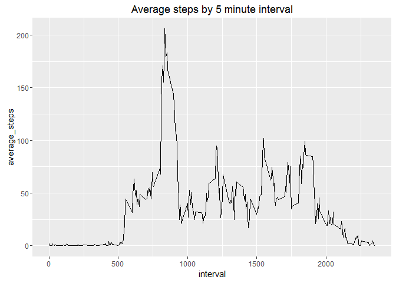

### 1. Loading and Pre-processing the Data

    data <- read.csv("activity.csv")
    complete_data <- na.omit(data)

### 2. What is mean total number of steps taken per day?

    total_steps <- sum(complete_data$steps)
    data_by_day <- group_by(complete_data, date) %>% summarize(total_steps = sum(steps))
    hist(data_by_day$total_steps, main = "Steps per Day", xlab = "Steps per Day")

    mean_steps <- round(mean(data_by_day$total_steps))
    median_steps <- median(data_by_day$total_steps)

The mean steps taken per day is 10766 and the median steps taken per day
is 10765. The total steps taken during the time period is 570608.

### 3. What is the average daily activity pattern?

    interval_data <- group_by(complete_data, interval) %>% summarize(average_steps = mean(steps))  
    ggplot(interval_data, aes(interval, average_steps))+geom_line()+labs(title = "Average steps by 5 minute interval")

    max_interval <- interval_data$interval[which.max(interval_data$average_steps)]

The interval with the largest average number of steps is 835.

### 4. Imputing missing values

    num_NA <- sum(is.na(data$steps))
    completer_data <- merge(data, interval_data, "interval")
    completer_data$steps[is.na(completer_data$steps)] <- completer_data$average_steps[is.na(completer_data$steps)]
    completer_day_data <- select(completer_data, -average_steps) %>% group_by(date) %>% summarize(total_steps = sum(steps))

    hist(completer_day_data$total_steps, main = "Steps per Day", xlab = "Steps per Day")

    mean_steps2 <- round(mean(completer_day_data$total_steps))
    median_steps2 <- round(median(completer_day_data$total_steps))

This time the mean steps taken per day is 10766 which is the same as
last time. The median steps per day is 10766 which is now different than
the last time.

### 5. Are there differences in activity patterns between weekdays and weekends?

    weekday <- c("Monday", "Tuesday", "Wednesday", "Thursday", "Friday","Saturday", "Sunday")
    day_group <- c("Weekday", "Weekday", "Weekday", "Weekday", "Weekday", "Weekend", "Weekend")
    weekends <- cbind(weekday, day_group)
    completer_data <- mutate(completer_data, weekday = weekdays(as.Date(date))) %>% merge(weekends, "weekday") %>% select(-weekday,-average_steps) %>% group_by(interval,day_group) %>% summarize(average_steps = mean(steps))
    ggplot(completer_data, aes(interval, average_steps)) + geom_line() + facet_grid(day_group ~.) + labs(title = "Average steps by 5 minute interval")

